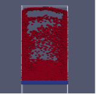
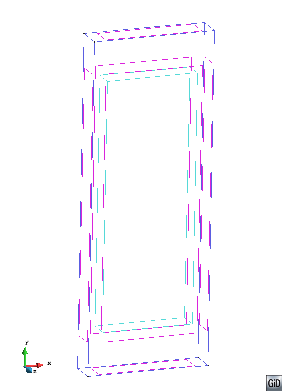
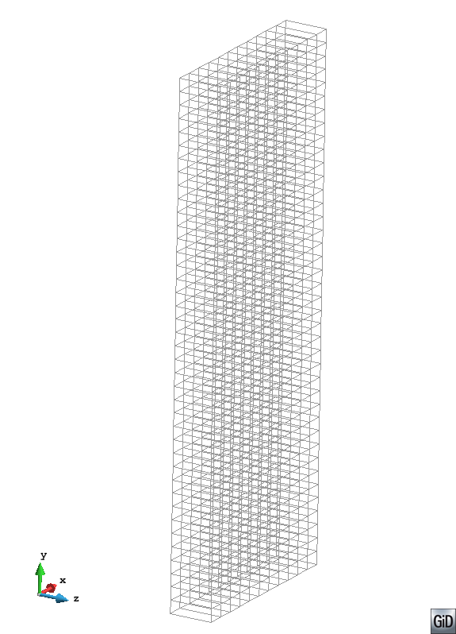
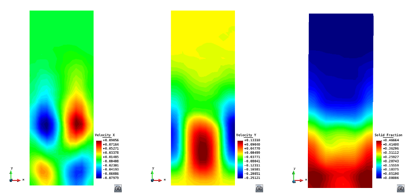
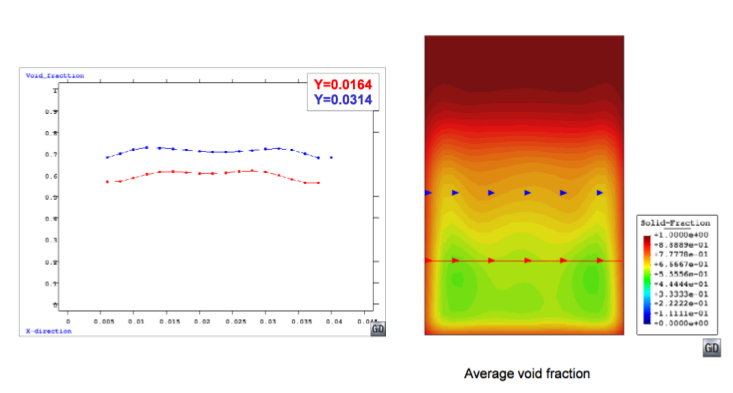

*Title: Analysis of dynamic systems: Fluidized bed*

*Author: Prashant Gupta*

*Date: February 28, 2014*

##Introduction

This document describes pre and post processing of fluidized bed system using P4 tool developed in University of Edinburgh. Brief description of 3D DEM-CFD simulation is presented in following section, followed by pre and post processing of particle data (DEM). This case study was done as a post processing of validation data. High quality validation experimental data obtained was used for comparisons. Time averaged particle velocity and solid fraction profiles/contours were obtained. This case study would demonstrate how to post process DEM data obtained from simulations to compare against experiments.
Millimeter size particles are subjected to a fluidizing velocity much greater than minimum fluidization velocity. This leads to transient bubbling/slugging regime. Bubbles are formed around the distributor plate, rise and coalesce and collapse at the free surface of the bed. Hence, bubbling and mixing behavior leads to lower solid fraction in the middle of the bed and lower particle velocities at the walls. Typical snapshot of such a phenomenon can be seen in figure 1.

*Figure 1: Typical snapshot of DEM-CFD simulation of gas-solid fluidized bed with particle size 1.2 mm and density 1000 kg/m at inlet velocity 0.9 m/s*

**Input:**
DEM data in this tutorial is extracted from Lammps using dump class available in Lammps-ed version. For more details, refer to the P4 Manual on how to dump data from lammps-ed.

**Output:**
This tutorial is aimed at explaining meshing required and outputting useful results such as smooth contour plots and line plots for dynamic granular system such as fluidized bed. After this tutorial, Following output would be obtained:
- Smooth contour plots of solid fraction and solid velocities.
- Line plot of these quantities at different heights (as measured in experiments).

3-D DEM-CFD simulation of a bubbling fluidized bed was done by coupling Lammps and OpenFOAM outputting useful particle data (DEM) at high sampling frequency. Table 1 gives the simulation parameters including particle size, density and domain size.

##Pre-processing

Domain of the problem is a pseudo 3-D cuboid which is created according to the simulation parameters given in the table. Idea is to create a rectangular section with x from 0.0 to 0.044 and y from 0.0 to 0.12 and extrude in z direction. This can be done by following these step:

- Create a rectangle by `Menu ⇒ Geometry ⇒ Object ⇒ Rectangle` and enter first centre point as (0.0 0.0 0.0), ENTER, second point as (0.044 0.12 0.0). Always useful to use zoom frame for a better visibility and fit to the screen.
- Extrude this in Z direction by `Menu ⇒ Utilities ⇒ Copy`. From the toolbox select: Entities Type: Surfaces Transformation: Translation First point (0.0 0.0 0.0) and second point (0.0 0.0 0.01). Do extrude Volumes Select. (This will lead to a geometry like figure 2)
- Next step is to mesh the geometry: Regular structured mesh with hexahedral elements will be used in the present example.

Select `Menu ⇒ Mesh ⇒ Structured ⇒ Volume ⇒ Assign number of cells` and then select the geometry and press esc. Enter number of cells to assign to lines as : 1 and select any line on Z axis, press Esc. proceed with assigning number of cells as 11 in X axis and 40 on Y axis. This defines the spatial scale at which the coarse grained quantities would be calculated.
To assign elements as hexahedral : Again select `Menu ⇒ Mesh ⇒ Element type ⇒ Hexahedra` and select the volume, press Esc.

`Menu ⇒ Mesh ⇒ Generate Mesh` (or `Ctrl-g`), press `OK` & `View Mesh`. This should look like figure 3. Change view to X-Y.
Save the project in `Menu ⇒ File ⇒ Save`.

  | Particle Info             |   Value   |
  |:--------------------------|:----------|
  | Number of Particles       |   9240    |
  | Diameter (mm)             |   1.2     |
  | Sphericity                |   1       |
  | Particle Density (kg/m3)  |   1000    |
  | **Geometry**              | **Value** |
  | Bed width (m)             |   0.044   |
  | Bed height (m)            |   0.12    |
  | Bed thickness (m)         |   0.01    |

*Table 1: Particle information*

*Figure 2: Domain for meshing as produced by GiD*

##P4 settings

Dump files are created by lammps as dump.p3p, dump.p3c and dump.p3w as particle definition file, contact data and particle-wall contact data respectively.
Next P4 toolbox is loaded by going to `Data ⇒ Problem type ⇒ p4-v0.4` (whichever is the latest version).
This will load P4 toolbox.
Click on the CG preferences button just below P4 symbol.
Following settings are used in the P4 tool box for present example.

**Input**

- `FILENAME`: Browse to the destination of dump.p3p and select.
- `READ CONTACTS`: NO (Not for the present case)
- `READING TIME STEPS`: ALL
- `STEP FREQUENCY`: 1
- `FILTERING ID`: Filter Group ID 3 (these are fixed particles in the simulations for present case)

*Figure 3: Regular structured mesh for post processing*

**Time Averaging**

- `USE TIME AVERAGE`: Yes
- `TIME AVERAGE`: ALL

**Spatial Averaging**

- `TYPE`: Binning

**Output**

- `FILE TYPE`: GID BINARY is chosen in this particular example.
- `PRINT PARTICLES`: YES option is checked to visualise particles.

After selecting appropriate settings, press `SELECT` and save the project file once more. Start process, after finished click on post process. Load the post-process file (.post.bin) from the post processing tool box. Data is now loaded to be visualized. This example primarily brings out time and spatial averaged contour plots of a bubbling fluidized bed.

##Post Processing

These can be visualized by: Go to `Menu > View Results > Smooth Contour Fill > Solid Fraction or Velocity X,Y`. This would provide us time averaged smooth contour plots like in figure 4.

*Figure 4: Time averaged contour plots of bubbling fluidized beds showing (a) Averaged velocity in axial direction (b) Averaged vertical velocity (c) Averaged solid fraction*

For obtaining graph (say a line plot) 5, Use GiD utilities to make line plots at different heights Y = 0.0164 m and 0.0312 m. Go to: `Several graphs option > Line graph > Solid fraction`. This will prompt to select points, enter coordinates as *(0.0, 0.0164)* and *(0.044, 0.0164)* to plot line variation graph at height 0.0164 m. (Refer to GiD manual if more information is required)

*Figure 5: Line plot variation in axial direction for solid fraction at heights 0.0164 and 0.0312 m*

