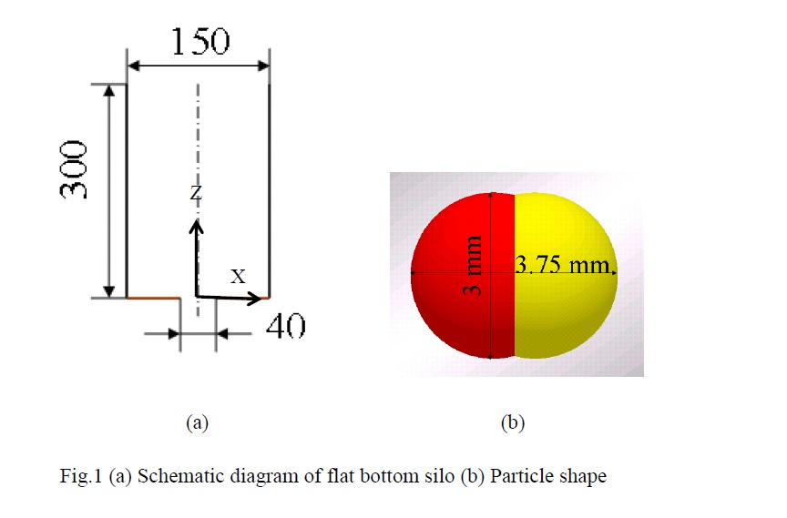
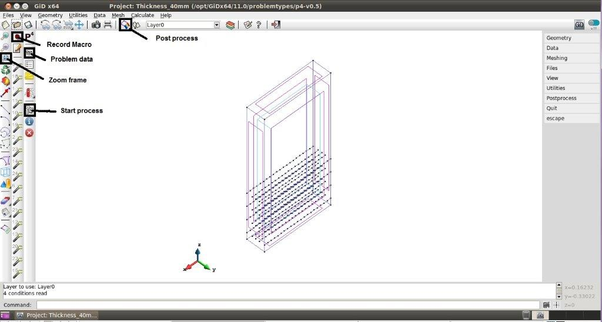
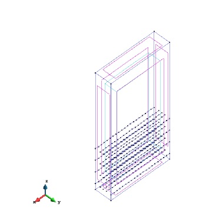
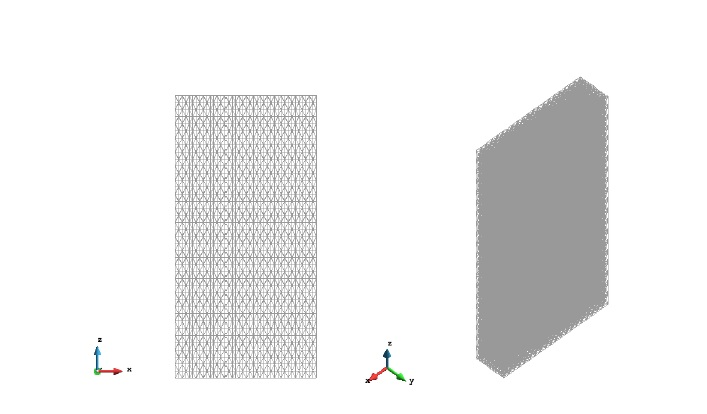
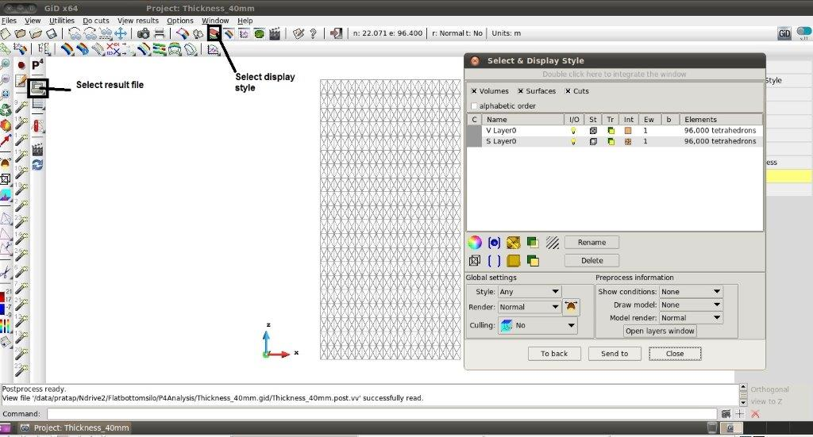
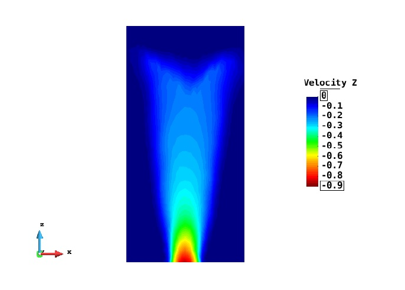
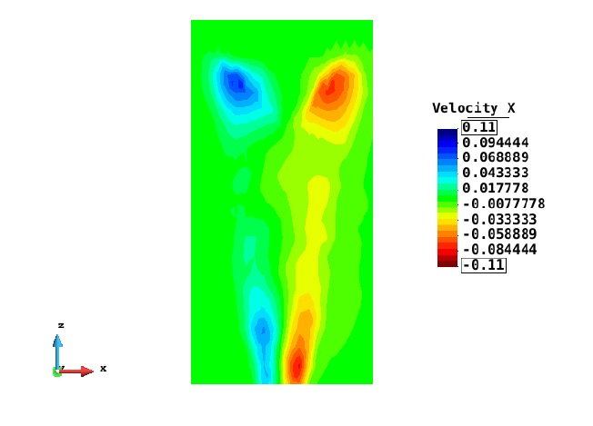
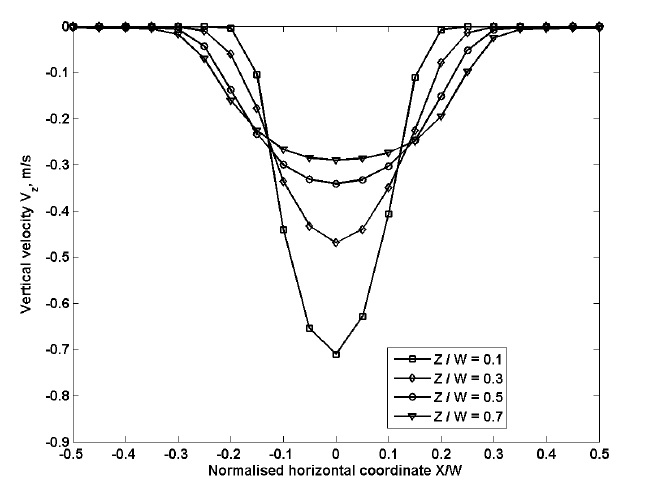
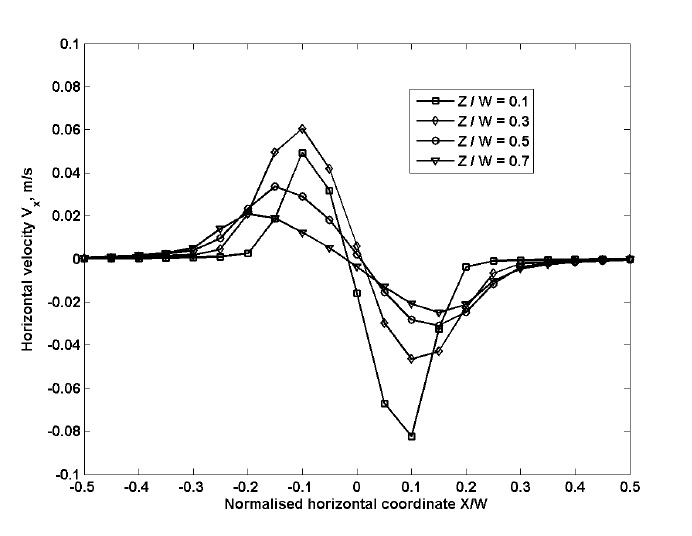

*Title: Silo flow*

*Author: Pratap Kasina*

*Date: February 2014*

##Introduction

The objective of this tutorial is to demonstrate how to convert the particle scale data that is generated from DEM to a scale at which the experimental data is usually collected.
Particle scale data is averaged spatially using coarse graining technique and the
theoretical background of this technique is discussed in P4 manual. The flow patterns
of granular solids in flat bottom silo is analysed using P4 in order to validate the model
by comparing the results with experimental observations.

The discharge of non-spherical particles in flat bottom silo was simulated using EDEM
2.5.1 software. The silo is of 40 mm thick with an outlet width of 40 mm as shown
in Fig 1a. The shape of the particle was modelled as combination of two spheres of
diameter 3 mm clumped together to give an aspect ratio of 1.25 as shown in Fig.1 (b).
The silo is centrally filled from the top and the filling is considered to be completed
when the total kinetic energy of the system reaches below 1E-08 J which is negligible
when compared to the total K.E of the system during discharge (J). The material is
them allowed to discharge by removing the outlet plate.

The data is exported at 200 Hz from EDEM during 20-30 % of material discharged from
the silo. The results which are time averaged during 20-30 % of material discharged
from the silo are reported here in the form of contour and graphical plots. The following
sections describe the procedure to achieve the above mentioned objective with the use of
GiD software combined with P4 plugin which includes three main steps: pre- processing,
averaging the data, post processing.

*Figure 1: (a) Schematic diagram of flat bottom silo (b) Particle shape*

##Pre-processing

The pre-processing includes creating the geometry of the system followed by discretisation of the domain with one of the various methods available in GiD.

**Create a box**

- `Geometry ⇒ Create ⇒ Object ⇒ Rectangle`.
- Specify the corner points of a rectangle: First corner point is (-0.075, 0.04,0) and Second corner point is (0.075,0,0)
- Volume can be created by sweeping the rectangle along Z axis. Select `Utilities ⇒ Copy`. In the Copy window, select Surfaces and Translation from the drop down
lists next to Entity types and Transformation. Select volumes from the list next to Do Extrude
- The height of extrusion is specified by first point (0, 0, 0) and second point (0, 0, 0.3).
- Click Select button and the click the rectangle in the viewer window and press Escape.
- `Select Zoom ⇒ View ⇒ Frame` to fit the box in the view window. This can also be accessed directly from the standard tool bar as shown in Fig 2.

*Figure 2: Layout of GiD pre-processor*

**Create lines for graph**

It is recommended to create additional lines in the domain along which the results are expected to plot. This avoids any interpolation of data by GiD while plotting a line
graph (refer to section 4.5) if there are no nodes on the line. The P4 then calculates the information on the nodes of these lines.

Having decided the location of lines for graphs it is easy to generate all of them at once by recording a macro while create one line and then edit the same macro to create
multiple lines in one click. The process in described below:

- Click on record macro button (as shown in Fig 2)
- `Geometry ⇒ Create ⇒ Straight line`. Input the coordinates of the line from command window as (-0.075, 0.015, 0) and (0.075, 0.015, 0).
- `Geometry ⇒ Edit ⇒ Divide ⇒ lines ⇒ Number of divisions`. Enter 20 and click ok. This prompts the user to select lines from the viewer window. Select the line created in step 2 and press escape (In GiD, pressing Escape key ends a command or finishes input definition for any selected function).
- Stop recording the Marco by click the same button. This saves a macro file (displayed next to the record macro button) and right clicks the file and select
edit widow: copy the first command of the macro multiple times and change the coordinates of the lines in commands. Create four equally spaced lines along Y
direction at heights of 0.015, 0.045, 0.075, and 0.105 as shown in Fig 3.

*Figure 3: Problem domain showing the lines for graphs*

**Meshing**

The volume is meshed with structured tetrahedral elements. The user has also have options to mesh the volumes with other element types including hexahedral and prisms.
The following procedure demonstrates how to generate structured mesh with tetrahedral elements.

**Define the mesh size**

Select `Mesh ⇒ Structured ⇒ Volumes ⇒ Assign number of cells`.

Select the volume by clicking on Cyan coloured boundary (By default, volumes are represented by this colour) with mouse and pressing Escape pops ups Enter value
window. Specify the number of cells to be assigned along each axis. Enter 20 and click assign and then select any line parallel to X-axis which then automatically selects the
rest of lines parallel to X-axis and press Escape. Repeat the same procedure and assign 20 and 4 number of cells along Z and Y axis respectively. Close the enter the value
window after the finishing the assignment.

**Define the element type**

Select `Mesh ⇒ Element Type ⇒ Tetrahedral`. This prompts you to select the volumes to assign the tetrahedral elements. Select the volume. Press Escape

**Generate mesh**

Select `Mesh ⇒ Generate mesh`. In the mesh generation window tick the get parameters from the model option and then select OK. This generates the mesh as shown
Fig 4.

*Figure 4: Box meshed with tetrahedral elements*

##Analysis settings

This section describes the definition of parameters required to average the DEM results using P4.
This includes the specification of which coarse graining function to be used, coarse graining width and cut-off factor (for more details refer P4 manual), the method
of time averaging and format of output file for saving the data.

Click on the problem data icon of P4 toolbar as shown in Fig 2 which opens up a problem data window.

The following values were used for this exercise:

**Input**

- `PARTICLES FILENAME` : Read the .p4p file (refer to P4 manual for conversion of DEM data to .p4p)
- Tick Process Contacts Files option.
- `READING TIME STEP` : ALL
- `STEP FREQUENCY` : 1

**Time Averaging**

- Activate Time Averaging is checked.
- `TIME AVERAGE` : ALL.

**Spatial Averaging**

- `TYPE` : COARSE GRAINING
- `FUNCTION TYPE`: GAUSSIAN
- `WIDTH` : GLOBAL
- `WIDTH VALUE` : 0.0045
- `CUT-OFF VALUE` : 3
- `SPATIAL INTEGRAL` : NO.
- `CALCULATE GRADIENTS` : YES.

**Output**

- `FILE TYPE` : GiD Binary
- `OUTPUT FILE` : Other
- `OUTPUT FILENAME` : Give appropriate output file. P4 writes the all data to this file.

Click on start process as shown in Fig 2 and the progress can be monitored by clicking on information icon next to start process icon. A message pops up on the screen after
the process is finished. This generates .bin file in the working directory. At this stage, the pre-processing of DEM results is finished and by clicking on the post processing
icon shown in Fig 2 the GiD switches to post processing mode.

##Post-processing

This section describes on how to visualise the results using contour plots and graphs.
GiD has also several other options to visualising the results, for example iso-surfaces, streamlines etc (refer GiD manual for more information).

**Load result file**

Select the result that was generated by clicking on the icon as shown in the Fig.5 and this loads the result file onto the mesh that is created in pre-processing.

**Select the time step for visualisation**

You can select the time step at which results has to be visualised. As in this case, the time averaging has been done for all time steps, only the results at averaged time step
is available. `View Results ⇒ Default Analysis/Time step ⇒ Time Step`. Select the time step for analysing the result. In this case only one time step is displayed.

**Select display style**

There are various options in GiD to display the geometry which are discussed in P4 Manual.
The display can be customised, for example turning off the mesh elements, turning on/off the other geometric elements. The display of mesh elements and lines
that are created for graph can be turned off from the *SELECT AND DISPLAY STYLE* window. The geometric entities present in the domain are displayed as a list in *SELECT
AND DISPLAY STYLE WINDOW* and any selected entity can be turned off from display by click on I/O. Similarly the mesh elements can be turned off by selecting the
solid option for the section ST as shown in Fig 5.

*Figure 5: Layout of GiD post processor*

**Visualisation and export contour plots**

The flow patterns at selected time step can be visualised as contour plots of velocity as illustrated below:

- `View Results ⇒ Contour Fill ⇒ Velocity ⇒ Velocity Z`

- `View Results ⇒ Contour Fill ⇒ Velocity ⇒ Velocity X`

*Figure 6: Contour plot of vertical velocity (m/s)*

*Figure 7: Contour plot of horizontal velocity (m/s)*

The images can be saved as .tiff format by selecting `File ⇒ Print to file ⇒ Tiff`.
The page settings (size, resolution) for exporting the image can be changed from
`Files ⇒ Page and Capture Settings`.

Plot and exporting graphs Similar to the creation of lines as described in section 2.2,
macros can be recorded for plotting a single graph for a given variable on given line
along specified direction. The macro can be edited create multiple graphs at multiple
location on a single click. The procedure for this is as follows:

1. Start record macro (as mentioned in section 2.2)
2. `View Results ⇒ Line graphs ⇒ Set X axis ⇒ X variation`
3. `View Results ⇒ Line graphs ⇒ Velocity ⇒ Velocity Z`
4. Input the coordinates (-0.075, 0.015,0 and 0.075, 0.015, 0) of the line through command window. This generates a graph.
5. `File ⇒ Export ⇒ Graph ⇒ All`. This saves the graph as ASCII file which can read into MATLAB or EXCEL.
6. Stop record the macro.
7. Edit the created macro (displayed next to record macro button) by right clicking on it and select Edit window. Copy paste the first command into subsequent lines
and change the line definition and the variable name to be plotted.

The vertical velocity profiles plotted at five different Z locations and at Y= 0 is shown in Fig 8.
The graph is produced from MATLAB by reading ASCII file generated by running the above created macro.

*Figure 8: Vertical velocity profiles at different heights from the outlet.*

*Figure 9: Horizontal velocity profiles at different heights from the outlet.*